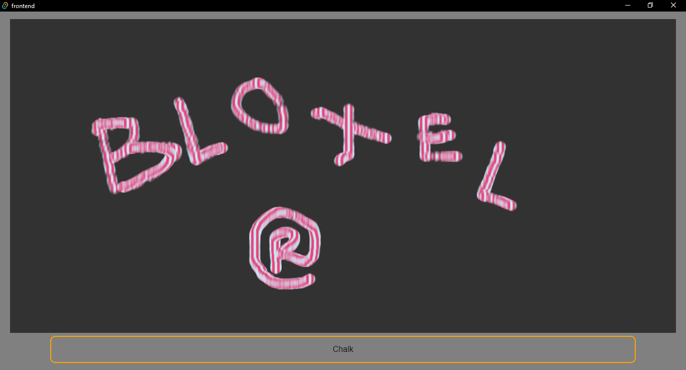
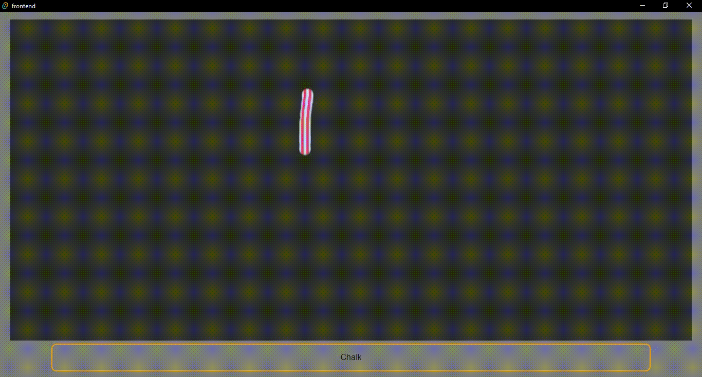

# Bloxel

Bloxel is a digital chalkboard application built with Tauri and React. It is designed to be used as a lecture board with chalk-like user experience.

## Features

### Design Chalks
Bloxel includes the concept of "design chalks," allowing users to create custom chalks with special cross-sectional colors.

### Straight Line Correction
Algorithms to correct straight lines, ensuring your drawings and notes are clean and precise.
To detect straight lines, we points with equal intervals are sampled along a line, then the standard diviation of the gradients between successive points are calculated. If this standard deviation falls within a treshold, it is considered a straight line with gradient equal to the average gradient and passes through the centroid of sampled points. 

### Export to PDF and PPT
Currently incorporating libraries for conversion of canvas to pdf, png, jpg, ppt, etc.
Also, I will soon to add more tools like undo, redo, next page, drag page, etc.

## Screenshots

## Installation

To install and run Bloxel locally, follow these steps:

- Install rust
- Install Node
- Clone the repository
- run `npm install`
- run in dev mode with `cargo tauri dev`
- build a binary with `cargo tauri build`
