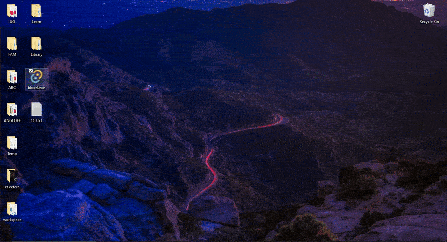

# Bloxel

Bloxel is a digital chalkboard application built with Tauri and React. It is designed to be used as a lecture board with chalk-like user experience.

## Features

- Design Chalks
- Straight Line Correction
- Export to PDF
- Import a .bloxel file

## Screenshots

## Installation

To install and run Bloxel locally, follow these steps:

- Install rust
- Install Node
- Clone the repository
- run `npm install`
- run in dev mode with `cargo tauri dev`
- build a binary with `cargo tauri build`
